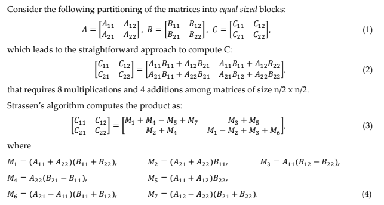

# Parallel_Computing
Content about CSCE 735 - Parallel Computing. Involve a major project with Strassen's algorithm on matrix multiplication and several assignments implementing parallel methodology on general algorithms.

## Strassen's Algorithm with OpenMP
### Implementation
Strassen's algorithm accelerates matrix multiplication from O(n<sup>3</sup>) to O(n<sup>2.8</sup>). Below is the brief introduction of it. 



Through the help of seven pre-calculated matrices, the execution to have final matrix C requires much less time. In the basic of this algorithm, I further applied parallel strategy with OpenMP to further enhance the performance. Since Strassen's algorithm employs recursive revoking matrix mutiplication to obtain the result, we can dynamically assign the tasks to threads for horizontal execution.  

### Experiment Result
| Basement Matrix Size  | Matrix Size | Threads | Execution Time | Speedup | Efficiency|
| :---: | :---: | :---: | :---: | :---: | :---: |
| 32 | 2048 | 1 | 13.02552 | \ | \ |
| 32 | 2048 | 2 | 7.94801 | 1.63884 | 0.81942 |
| 32 | 2048 | 4 | 6.52178 | 1.99723 | 0.49930 |
| 32 | 2048 | 8 | 6.77623 | 1.92237 | 0.24028 |
| 32 | 2048 | 16 | 9.83172 | 1.32485 | 0.08280 |
| 32 | 2048 | 32 | 10.59821 | 1.22903 | 0.03841 |
| 32 | 2048 | 64 | 11.75660 | 1.10793 | 0.01731 |
| 32 | 2048 | 128 | 12.29747 | 1.05920 | 0.00828 |
| 32 | 2048 | 256 | 13.75349 | 0.94707 | 0.00370 |
| 32 | 2048 | 512 | 21.17387 | 0.61517 | 0.00120 | 
| 32 | 2048 | 1024 | 52.06498 | 0.25018 | 0.00244 |

From the above table can we observe that the maximum speedup is close to 2, but the efficiency drops significantly with increased threads. Therefore, the better method we apply parallel methodology on Strassen's algorithm is to split a large-scale matrix into pieces, like 1024x1024, to process on a microprocessor system. Acccordingly, the computation will not consume too much resource and still acquire decent performance.

### Command
```C
module load intel   
icpc -qopenmp -o omp_strassen.exe omp_strassen.cpp  
./omp_strassen.exe -mat_size -num_threads
```

## Contact Info
Author: Chun-Sheng Wu, MS student in Computer Engineering @ Texas A&M University  
Email: jinsonwu@tamu.edu  
LinkedIn: https://www.linkedin.com/in/chunshengwu/
